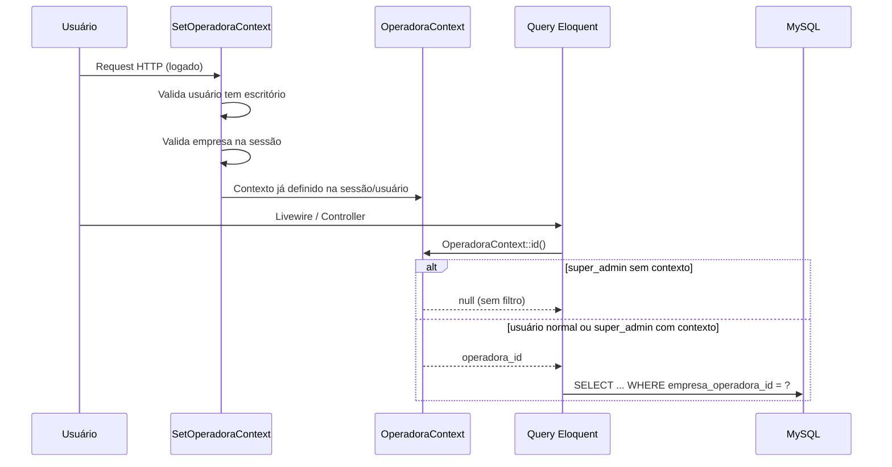

# Fase 1 — Multi-tenancy: o que foi implementado

> **Documento de referência** para análise do estado atual do IntegraExpert.  
> **Data:** junho/2026 · **Status:** Fase 1 concluída  
> **Plano original:** `docs/ESCALA_MULTI_ESCRITORIO.md`

---

## 1. Resumo executivo

O IntegraExpert passou de um sistema **single-tenant** (um único escritório) para um modelo **multi-tenant**, onde cada **escritório contábil** (chamado de **operadora** ou **tenant**) tem seus dados isolados.

**O que isso significa na prática:**

- Usuários de um escritório **não veem** empresas, importações, lançamentos ou terceiros de outro escritório.
- Um **super admin** da plataforma pode ver todos os escritórios e, opcionalmente, "entrar" em um deles via seletor no header.
- Arquivos exportados (OFX, TXT contábil, CSV) ficam em pastas separadas por escritório.
- O CNPJ de empresa cliente deixa de ser único no mundo inteiro e passa a ser único **por escritório**.

**O que ainda não existe** (Fases 2–5): onboarding self-service, painel de métricas, filas assíncronas, billing, subdomínio funcional, impersonate.

---

## 2. Glossário rápido

| Termo | Significado no sistema |
|-------|------------------------|
| **Operadora / Escritório / Tenant** | Cliente SaaS — o escritório contábil que usa a plataforma. Tabela: `empresas_operadoras` |
| **Empresa** | Empresa **cliente** do escritório (a que recebe lançamentos). Tabela: `empresas` |
| **Contexto de operadora** | Qual escritório está "ativo" na sessão atual. Armazenado em `session('operadora_context_id')` |
| **Empresa selecionada** | Qual empresa cliente está ativa nos formulários. `session('empresa_selecionada_id')` |
| **Global Scope** | Filtro automático do Eloquent que adiciona `WHERE empresa_operadora_id = ?` em todas as queries |
| **super_admin** | Papel da plataforma. Não pertence a nenhum escritório (`empresa_operadora_id = null`) |
| **admin / gerente / operador** | Papéis dentro de um escritório. Sempre vinculados a uma operadora |

---

## 3. Checklist da Fase 1 (plano vs. realizado)

| # | Item do plano | Status | Observação |
|---|---------------|--------|------------|
| 1.1 | `empresa_operadora_id` nas tabelas | ✅ | 10 tabelas + `users` |
| 1.2 | Global Scope (`BelongsToOperadora`) | ✅ | 9 models; `User` tratado à parte |
| 1.3 | Middleware de contexto | ✅ | `SetOperadoraContext` |
| 1.4 | Papel `super_admin` | ✅ | Enum no MySQL + métodos no `User` |
| 1.5 | Seletor de empresa filtrado | ✅ | Blade partial no header |
| 1.6 | Rotas com ID validadas (anti-IDOR) | ✅ | `/trocar-empresa`, downloads, Livewire |
| 1.7 | Migration de dados legados | ✅ | Tudo vinculado à operadora ID 1 |
| 1.8 | Testes de isolamento | ✅ | 10 testes em `TenantIsolationTest` |

**Extras implementados além do mínimo da Fase 1:**

- Storage por tenant (`OperadoraStorage`)
- White-label leve no header (logo + nome fantasia)
- Campos comerciais em `empresas_operadoras` (`plano`, limites, `subdominio`)
- CRUD de escritórios em `/empresas-operadoras` (só super admin)
- Bloqueio de exclusão de escritório com dados vinculados

---

## 4. Arquitetura implementada

### 4.1 Fluxo de uma requisição autenticada



### 4.2 Componentes centrais

```
app/
├── Models/Concerns/BelongsToOperadora.php   # Trait: global scope + auto-fill no create
├── Services/
│   ├── OperadoraContext.php                 # Quem é o tenant ativo
│   └── OperadoraStorage.php                 # Arquivos em {id}/temp e {id}/exports
├── Rules/EmpresaDoEscritorio.php            # Validação anti-IDOR em formulários
└── Http/Middleware/SetOperadoraContext.php    # Valida sessão a cada request
```

### 4.3 Como o tenant é determinado

| Tipo de usuário | `OperadoraContext::id()` retorna |
|-----------------|----------------------------------|
| `operador`, `gerente`, `admin` | `users.empresa_operadora_id` (fixo) |
| `super_admin` sem seletor | `null` → vê **todos** os dados |
| `super_admin` com escritório selecionado | `session('operadora_context_id')` → vê **só aquele** escritório |

---

## 5. Banco de dados

### 5.1 Migrations aplicadas

| Arquivo | O que faz |
|---------|-----------|
| `2026_06_13_000001_add_multi_tenant_support.php` | Coluna `empresa_operadora_id`, role `super_admin`, dados legados, CNPJ único por escritório |
| `2026_06_13_000002_add_plano_fields_to_empresas_operadoras.php` | `plano`, `limite_empresas`, `limite_usuarios`, `subdominio` |

### 5.2 Tabelas com `empresa_operadora_id`

| Tabela | Observação |
|--------|------------|
| `users` | Nullable **apenas** para `super_admin` |
| `empresas` | CNPJ único por par `(empresa_operadora_id, cnpj)` |
| `importacoes` | |
| `lancamentos` | |
| `regras_amarracoes_descricoes` | |
| `layouts_importacao` | |
| `historicos_padrao_layout` | |
| `terceiros` | Antes era global — agora isolado |
| `conversoes_extrato` | |
| `amarracoes` | |

### 5.3 Tabela `empresas_operadoras` — campos relevantes

| Campo | Tipo | Uso atual |
|-------|------|-----------|
| `razao_social`, `nome_fantasia`, `cnpj` | string | Identificação do escritório |
| `logo` | string | White-label no header |
| `ativo` | boolean | Flag de suspensão (validada no middleware) |
| `plano` | enum string | `basico`, `profissional`, `enterprise` — **cadastro apenas, sem enforcement** |
| `limite_empresas` | int nullable | Cadastro apenas, sem bloqueio automático |
| `limite_usuarios` | int nullable | Cadastro apenas, sem bloqueio automático |
| `subdominio` | string nullable | Cadastro apenas, roteamento por subdomínio **não implementado** |

### 5.4 Dados legados (ambiente Dal Ongaro)

A migration associou automaticamente todos os registros existentes à **primeira operadora** do banco (ID 1 — Dal Ongaro Contabilidade). Usuários com `role != super_admin` e `empresa_operadora_id` nulo foram vinculados a ela.

---

## 6. Hierarquia de papéis

```
super_admin          → Plataforma (sem escritório fixo)
    └── admin        → Administrador do escritório
        └── gerente  → Gerente do escritório
            └── operador → Operador do escritório
```

| Papel | Escritório vinculado | Vê todos os tenants? | CRUD escritórios? |
|-------|---------------------|----------------------|-------------------|
| `super_admin` | Não (`null`) | Sim, sem contexto | Sim (`/empresas-operadoras`) |
| `admin` | Sim | Não | Não |
| `gerente` | Sim | Não | Não |
| `operador` | Sim | Não | Não |

**Usuário promovido a super admin:** `fabiano@iconeweb.com.br` (`empresa_operadora_id = null`).

---

## 7. Interface do usuário

### 7.1 Header (duas linhas)

```
Linha 1: [Logo/Nome do escritório]  [Menu]  [Avatar]
Linha 2: [Seletor Escritório ▼]  [Seletor Empresa ▼]   ← só quando aplicável
```

- **Seletor de escritório:** visível apenas para `super_admin`. Rota: `/trocar-operadora/{id?}`
- **Seletor de empresa:** visível para todos. Lista só empresas do escritório ativo. Rota: `/trocar-empresa/{id}`
- **White-label:** se o escritório tem `logo` e/ou `nome_fantasia`, substituem o branding padrão "IntegraExpert"

Implementação: partials Blade (`partials/seletor-operadora-global.blade.php`, `partials/seletor-empresa-global.blade.php`) — **não** Livewire no header (evita bugs de múltiplas raízes e travamentos).

### 7.2 Telas por papel

| Tela | Rota | Quem acessa |
|------|------|-------------|
| Home | `/home` | Todos |
| Escritórios (CRUD) | `/empresas-operadoras` | Só `super_admin` |
| Empresas clientes | `/empresas` | Todos (com contexto de escritório) |
| Usuários | `/usuarios` | Admin do escritório |
| Importador, Tabela, Exportador, etc. | rotas existentes | Todos (dados filtrados) |

### 7.3 Comportamento do super admin sem escritório selecionado

| Ação | Comportamento |
|------|---------------|
| Listar empresas/lançamentos | Vê dados de **todos** os escritórios |
| Cadastrar empresa cliente | **Bloqueado** — mensagem pede para selecionar escritório |
| Importar / exportar | Funciona se empresa selecionada pertencer a algum escritório (scope por empresa) |
| Gerenciar usuários | Lista filtrada; super admin sem contexto vê todos os não-super_admin |

---

## 8. Segurança e isolamento

### 8.1 Camadas de proteção

1. **Global Scope** — filtra queries automaticamente
2. **Middleware** — valida empresa na sessão; bloqueia usuário sem escritório
3. **Rotas** — `Empresa::find($id)` retorna 404 se empresa é de outro tenant
4. **Validação de formulários** — regra `EmpresaDoEscritorio` (substitui `exists:empresas,id` que ignorava o scope)
5. **Downloads** — `OperadoraStorage::resolveAbsolutePath()` só encontra arquivos do tenant ativo
6. **Livewire** — `findOrFail` / `resolveEmpresa` nos componentes críticos

### 8.2 Model `User` — tratamento especial

O model `User` **não** usa o trait `BelongsToOperadora` (causava recursão infinita ao chamar `Auth::user()` durante o boot do scope). Em vez disso:

- `scopeDoEscritorio()` — filtro manual nas telas de usuários
- Hook `creating` — preenche `empresa_operadora_id` no cadastro
- `isSuperAdmin()`, `isEscritorioAdmin()` — helpers de papel

### 8.3 Storage por tenant

```
storage/app/
├── exports/              ← legado (arquivos antigos ainda acessíveis)
├── temp/                 ← legado
└── {operadora_id}/
    ├── exports/          ← novos arquivos exportados
    └── temp/             ← uploads temporários
```

Componentes que usam `OperadoraStorage`:

- `ImportadorAvancado`
- `ImportadorPersonalizado`
- `ConversorPdfOfx`
- `ExportadorContabil`
- `ExtratorBancario`
- `GerenciadorHistoricosPadraoLayout`
- `ListaConversoesExtrato` (download)
- `ExportadorContabilController` (API)
- Rotas `/download/{arquivo}` e `/download-arquivo/{arquivo}`

---

## 9. Arquivos criados

| Arquivo | Função |
|---------|--------|
| `app/Models/Concerns/BelongsToOperadora.php` | Trait de multi-tenancy |
| `app/Services/OperadoraContext.php` | Serviço de contexto do tenant |
| `app/Services/OperadoraStorage.php` | Paths de arquivo por tenant |
| `app/Rules/EmpresaDoEscritorio.php` | Regra de validação |
| `app/Http/Middleware/SetOperadoraContext.php` | Middleware |
| `resources/views/partials/seletor-operadora-global.blade.php` | Seletor de escritório |
| `resources/views/partials/seletor-empresa-global.blade.php` | Seletor de empresa |
| `database/migrations/2026_06_13_000001_*.php` | Migration principal |
| `database/migrations/2026_06_13_000002_*.php` | Campos de plano |
| `tests/Feature/TenantIsolationTest.php` | Testes automatizados |

## 10. Arquivos modificados (principais)

| Arquivo | Mudança |
|---------|---------|
| `bootstrap/app.php` | Registro do middleware `SetOperadoraContext` |
| `routes/web.php` | Rotas de troca de escritório/empresa; downloads com tenant |
| `app/Models/User.php` | `super_admin`, scope `doEscritorio` |
| `app/Models/Empresa.php` (+ 8 models) | Trait `BelongsToOperadora` |
| `app/Livewire/GerenciadorEmpresas.php` | CNPJ por operadora; bloqueio super admin |
| `app/Livewire/GerenciadorUsuarios.php` | Filtro por escritório |
| `app/Livewire/EmpresasOperadorasForm.php` | CRUD escritórios + plano + bloqueio exclusão |
| `app/Http/Controllers/MenuController.php` | Dados para seletores e white-label |
| `app/Http/Controllers/Traits/MenuTrait.php` | Item "Escritórios" no menu |
| `resources/views/layouts/menu-blade.blade.php` | Header 2 linhas + branding |
| `resources/views/livewire/home.blade.php` | Link para escritórios (super admin) |
| Livewire de importação/exportação/conversão | Storage + validação tenant |

---

## 11. Testes automatizados

Arquivo: `tests/Feature/TenantIsolationTest.php`

| Teste | O que verifica |
|-------|----------------|
| `usuario_ve_apenas_empresas_do_seu_escritorio` | Global scope básico |
| `usuario_nao_acessa_empresa_de_outro_escritorio_via_rota` | Anti-IDOR em `/trocar-empresa` |
| `usuario_pode_trocar_para_empresa_do_proprio_escritorio` | Fluxo normal |
| `terceiros_sao_isolados_por_escritorio` | Terceiros antes globais |
| `super_admin_ve_todos_os_escritorios_sem_contexto` | Visão plataforma |
| `super_admin_com_contexto_ve_apenas_escritorio_selecionado` | Impersonação leve |
| `usuarios_sao_isolados_por_escritorio` | `User::doEscritorio()` |
| `download_de_arquivo_isolado_por_escritorio` | Segurança de arquivos |
| `storage_usa_diretorio_do_escritorio` | Paths corretos |
| `super_admin_sem_contexto_nao_cria_empresa_sem_escritorio` | UX de bloqueio |

**Executar:**

```bash
docker compose exec app php artisan test --filter=TenantIsolationTest
```

**Resultado atual:** 10 testes, 19 assertions — todos passando.

---

## 12. Como testar manualmente

### 12.1 Cenário básico (1 escritório — produção atual)

1. Logar como usuário normal do Dal Ongaro
2. Verificar que empresas, importações e terceiros aparecem normalmente
3. Importar um extrato e exportar — arquivo deve ir para `storage/app/1/exports/`

### 12.2 Cenário multi-tenant (2 escritórios)

1. Logar como `super_admin` (`fabiano@iconeweb.com.br`)
2. Acessar `/empresas-operadoras` e cadastrar um segundo escritório
3. Criar um usuário `admin` vinculado ao novo escritório (via `/usuarios` com escritório selecionado)
4. Criar uma empresa cliente no novo escritório
5. Logar como o admin do novo escritório → deve ver **só** os dados dele
6. Tentar acessar `/trocar-empresa/{id}` de empresa do outro escritório → deve retornar **404**

### 12.3 Super admin operando como tenant

1. Logar como `super_admin`
2. No header, selecionar "Dal Ongaro" no seletor de escritório
3. A página recarrega — agora vê só dados daquele escritório
4. Cadastrar empresa, importar, etc. funciona normalmente
5. Selecionar "Todos" / limpar escritório → volta à visão global

---

## 13. O que NÃO foi implementado (próximas fases)

| Fase | Itens pendentes |
|------|-----------------|
| **Fase 2** | Onboarding self-service, convite por e-mail, painel super admin com métricas, impersonate, subdomínio funcional |
| **Fase 3** | Filas Redis, processamento assíncrono, S3/MinIO, rate limiting, observabilidade |
| **Fase 4** | Billing, enforcement de limites de plano, trial/suspensão automática |
| **Fase 5** | Auditoria reforçada, pentest, DR |

### Dentro da Fase 1 — pontos menores não cobertos

| Item | Situação |
|------|----------|
| Global scope em `AlteracaoLog`, `HistoricoPadraoDescricao`, `LayoutColuna` | Não avaliado — impacto baixo |
| Enforcement de `limite_empresas` / `limite_usuarios` | Campos existem, lógica de bloqueio não |
| Migração de arquivos legados para `{id}/exports/` | Arquivos antigos permanecem em `exports/` com fallback |
| Roteamento por `subdominio` | Campo cadastrado, DNS/nginx não configurado |

---

## 14. Riscos e pontos de atenção

1. **Super admin sem contexto** vê tudo — adequado para gestão, mas exige cuidado ao operar (sempre verificar seletor antes de agir).
2. **Arquivos legados** em `storage/app/exports/` sem prefixo de tenant — acessíveis via fallback; migrar manualmente se necessário.
3. **Limites de plano** cadastrados mas não enforced — escritório pode cadastrar quantas empresas quiser.
4. **`exists:empresas,id`** ainda pode existir em algum formulário secundário — a regra `EmpresaDoEscritorio` cobre os fluxos críticos, mas uma varredura periódica é recomendada.
5. **Models secundários** sem escopo podem vazar metadados entre tenants em telas pouco usadas.

---

## 15. Comandos úteis

```bash
# Rodar migrations
docker compose exec app php artisan migrate

# Testes de isolamento
docker compose exec app php artisan test --filter=TenantIsolationTest

# Verificar operadoras no banco
docker compose exec app php artisan tinker --execute="App\Models\EmpresasOperadora::all(['id','nome_fantasia','plano','ativo'])"

# Verificar vínculo de empresas
docker compose exec app php artisan tinker --execute="App\Models\Empresa::select('id','nome','empresa_operadora_id')->get()"
```

---

## 16. Referências cruzadas

| Documento | Conteúdo |
|-----------|----------|
| `docs/ESCALA_MULTI_ESCRITORIO.md` | Plano completo (Fases 1–5) |
| `docs/PLANO_ESCALA_INTEGRAEXPERT.md` | Plano de escala geral |
| `docs/ROADMAP_ESCALA_SAAS-codex.md` | Roadmap detalhado alternativo |

---

*Documento gerado para análise interna. Atualizar conforme novas fases forem implementadas.*
